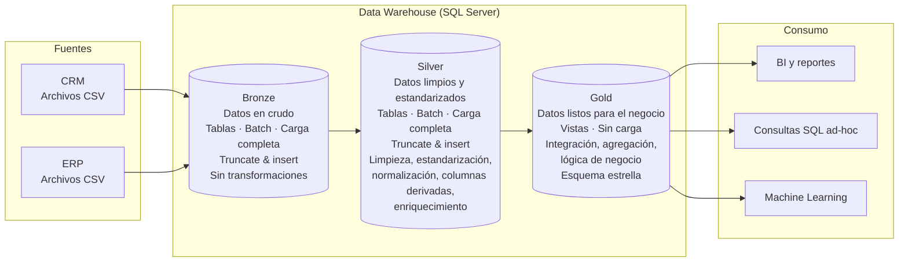
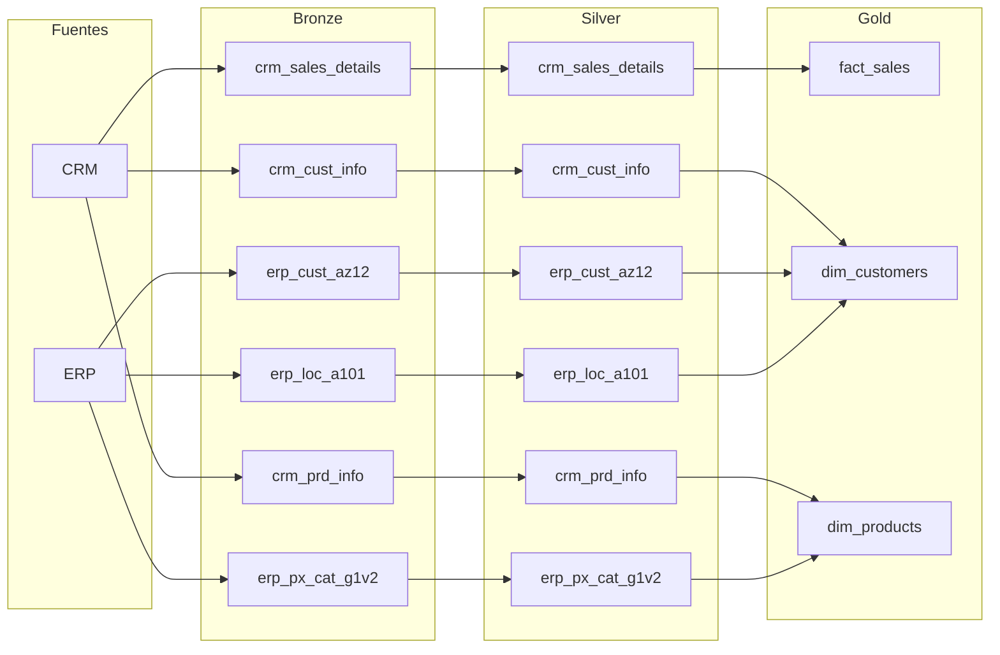
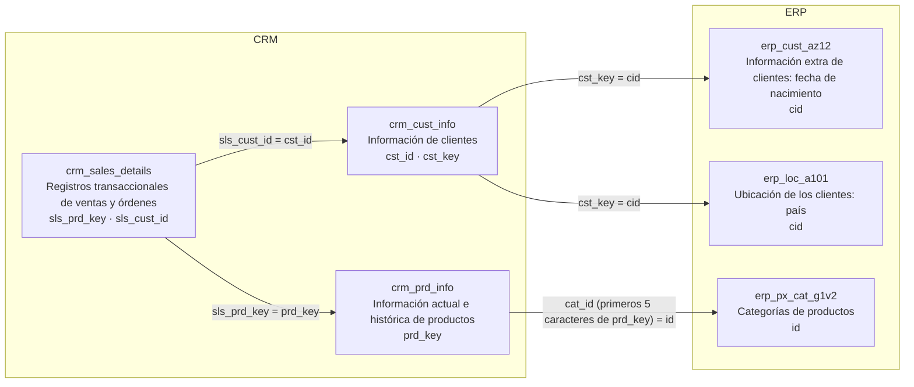
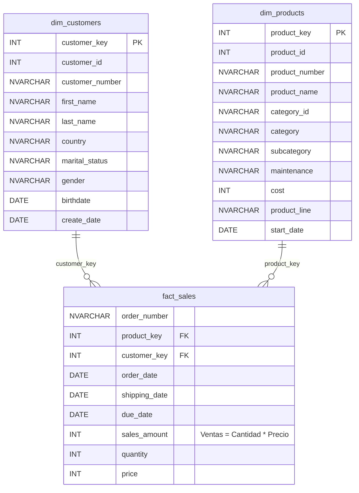

# Diagramas

## Arquitectura de datos (Medallion)

```mermaid
flowchart LR
    subgraph Fuentes
        CRM["CRM<br/>Archivos CSV"]
        ERP["ERP<br/>Archivos CSV"]
    end
    subgraph DWH["Data Warehouse (SQL Server)"]
        B[("Bronze<br/>Datos en crudo<br/>Tablas · Batch · Carga completa<br/>Truncate & insert<br/>Sin transformaciones")]
        S[("Silver<br/>Datos limpios y estandarizados<br/>Tablas · Batch · Carga completa<br/>Truncate & insert<br/>Limpieza, estandarización,<br/>normalización, columnas derivadas,<br/>enriquecimiento")]
        G[("Gold<br/>Datos listos para el negocio<br/>Vistas · Sin carga<br/>Integración, agregación,<br/>lógica de negocio<br/>Esquema estrella")]
    end
    subgraph Consumo
        BI["BI y reportes"]
        SQLQ["Consultas SQL ad-hoc"]
        ML["Machine Learning"]
    end
    CRM --> B
    ERP --> B
    B --> S --> G
    G --> BI
    G --> SQLQ
    G --> ML
```

## Flujo de datos (linaje de datos)

```mermaid
flowchart LR
    subgraph Fuentes
        CRM[CRM]
        ERP[ERP]
    end
    subgraph Bronze
        b1[crm_sales_details]
        b2[crm_cust_info]
        b3[crm_prd_info]
        b4[erp_cust_az12]
        b5[erp_loc_a101]
        b6[erp_px_cat_g1v2]
    end
    subgraph Silver
        s1[crm_sales_details]
        s2[crm_cust_info]
        s3[crm_prd_info]
        s4[erp_cust_az12]
        s5[erp_loc_a101]
        s6[erp_px_cat_g1v2]
    end
    subgraph Gold
        g1[fact_sales]
        g2[dim_customers]
        g3[dim_products]
    end
    CRM --> b1 & b2 & b3
    ERP --> b4 & b5 & b6
    b1 --> s1
    b2 --> s2
    b3 --> s3
    b4 --> s4
    b5 --> s5
    b6 --> s6
    s1 --> g1
    s2 & s4 & s5 --> g2
    s3 & s6 --> g3
```

## Integración de datos

```mermaid
flowchart LR
    subgraph CRM
        sales["crm_sales_details<br/>Registros transaccionales de ventas y órdenes<br/>sls_prd_key · sls_cust_id"]
        cust["crm_cust_info<br/>Información de clientes<br/>cst_id · cst_key"]
        prd["crm_prd_info<br/>Información actual e histórica de productos<br/>prd_key"]
    end
    subgraph ERP
        az12["erp_cust_az12<br/>Información extra de clientes: fecha de nacimiento<br/>cid"]
        loc["erp_loc_a101<br/>Ubicación de los clientes: país<br/>cid"]
        cat["erp_px_cat_g1v2<br/>Categorías de productos<br/>id"]
    end
    sales -- "sls_cust_id = cst_id" --> cust
    sales -- "sls_prd_key = prd_key" --> prd
    cust -- "cst_key = cid" --> az12
    cust -- "cst_key = cid" --> loc
    prd -- "cat_id (primeros 5 caracteres de prd_key) = id" --> cat
```

## Modelo de datos (esquema estrella)

```mermaid
erDiagram
    dim_customers ||--o{ fact_sales : "customer_key"
    dim_products  ||--o{ fact_sales : "product_key"

    dim_customers {
        INT customer_key PK
        INT customer_id
        NVARCHAR customer_number
        NVARCHAR first_name
        NVARCHAR last_name
        NVARCHAR country
        NVARCHAR marital_status
        NVARCHAR gender
        DATE birthdate
        DATE create_date
    }
    dim_products {
        INT product_key PK
        INT product_id
        NVARCHAR product_number
        NVARCHAR product_name
        NVARCHAR category_id
        NVARCHAR category
        NVARCHAR subcategory
        NVARCHAR maintenance
        INT cost
        NVARCHAR product_line
        DATE start_date
    }
    fact_sales {
        NVARCHAR order_number
        INT product_key FK
        INT customer_key FK
        DATE order_date
        DATE shipping_date
        DATE due_date
        INT sales_amount "Ventas = Cantidad * Precio"
        INT quantity
        INT price
    }
```
